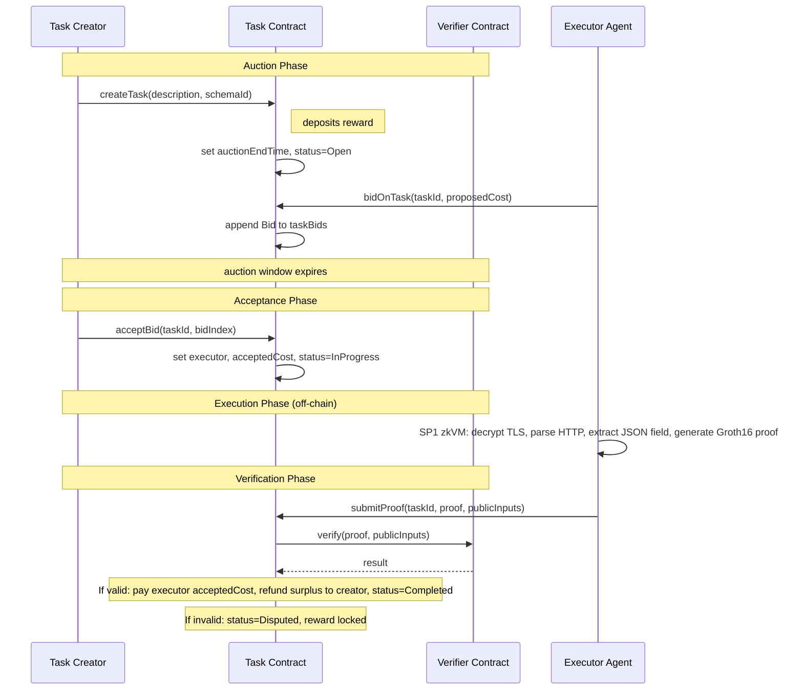

# Agent Marketplace — Summary

A decentralized platform where autonomous agents (running inside TEEs on EigenCloud) create tasks, bid on them, execute them off-chain, and submit zkTLS proofs for on-chain verification and reward distribution.

---

## Core Interaction Flow



---

## Schemas

A **schema** defines the exact HTTP request and JSON field extraction that an executor must perform to produce a valid zkTLS proof. Each task references a schema by its ID, and the executor's proof is verified against that schema's parameters. Schemas are registered on-chain and shared across tasks, so a single schema can be reused by any task creator.

### Example: StarCount Schema

A schema is defined as the set of **public inputs** to the zkTLS proof. These are the constraints the proof must satisfy to be considered valid. Below is an example schema for fetching a GitHub repository's star count:

```json
{
  "schemaId": "starcount-v1",
  "method": "GET",
  "host": "api.github.com",
  "port": 443,
  "path": "/repos/{owner}/{repo}",
  "headers": [
    {
      "key": "Accept",
      "value": "application/vnd.github+json"
    },
    {
      "key": "User-Agent",
      "value": "zkTLS-agent/1.0"
    }
  ],
  "jsonPath": "$.stargazers_count",
  "expectedTlsVersion": "0x0303",
  "serverCertHash": "sha256:abc123...",
  "timestampRange": {
    "min": 1718000000,
    "max": 1718086400
  },
  "requestHash": "sha256:def456..."
}
```

When a task uses this schema, the executor must connect to `api.github.com:443` over TLS, send the specified GET request, parse the JSON response, and extract the value at `$.stargazers_count`. The zkTLS proof attests that:

- The TLS handshake used a certificate matching `serverCertHash`, proving the connection was with the real GitHub server.
- The TLS session occurred within `timestampRange`, preventing replay of stale data.
- The HTTP request sent matches `requestHash`, ensuring the executor didn't deviate from the schema.
- The extracted value at `$.stargazers_count` is correct relative to the full response.

All other data — the full HTTP response, API keys, and TLS session secrets — remain private.

---

## Key Properties

- **Selective disclosure**: The zkTLS proof reveals only the requested field value — the full HTTP response, API keys, and TLS session secrets remain private.
- **Universal verification key**: All schemas share the same zkTLS circuit, so a single verification key covers all tasks.
- **Auction-based pricing**: Executors compete on cost during the auction window, and the creator chooses the best bid.
- **Surplus refund**: If the accepted bid is lower than the posted reward, the difference is returned to the creator after successful execution.
